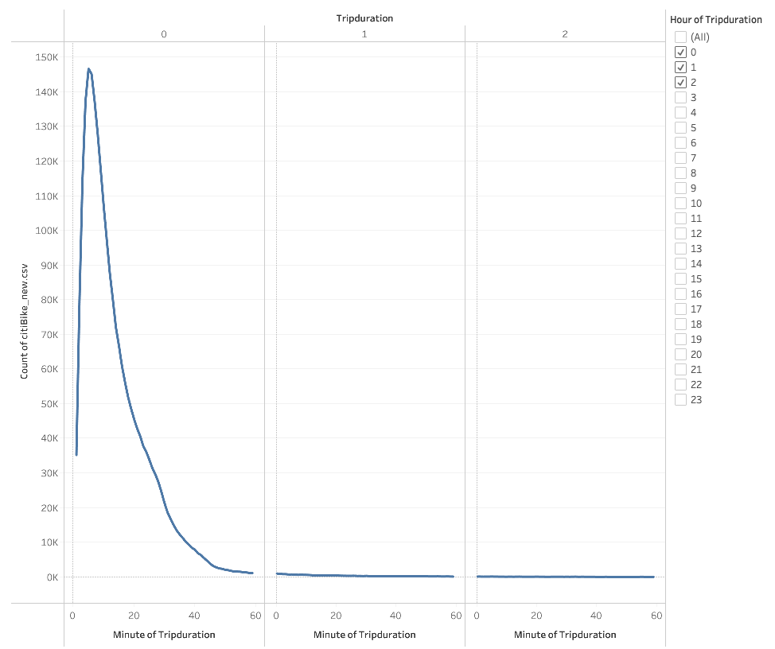

# Bikesharing

## Overview
The purpose of this analysis was to present a business proposal to help predict if a bike-sharing company could work in Des Moines, IA. To conduct the analysis and create effective visualizations, a CSV file titled "201908-citibike-tripdata" was imported into Tableau.

## Results
Below are some results of the analysis:

Total number of trips in the month of August was 2,344,224.
### 

There were total of **1,900,359** subscribers to the bike-sharing program whereas **443,865** were short-term customers.
### 

Per below graph, we can see that most of the bike users use the bike for up to 10 miniutes minimum to 60 minutes maximum.
### 

Below graph shows that males use the bike the most compared to females. We can also see that both males and females use the bike for 10 minutes minimum to 50 mininutes maximum and usage time does not exceed 1 hour.
### 

Bikes are being used mostly from 6 AM to 9 AM in the morning and 4 PM to 8 PM in the evening of the weekday.
### 

Both females and males use the bike mostly from 6 AM to 9 AM in the morning and 4 PM to 8 PM in the evening of the weekday with higher usage in males.
### 

Per below graph, we can see that bike usage is the most highest in male subscribes compared to female subcribers.
### 

[link to dashboard](https://public.tableau.com/app/profile/sohyun.choi/viz/Module_14Challenge_16224510407000/Story1 "link to dashboard")
